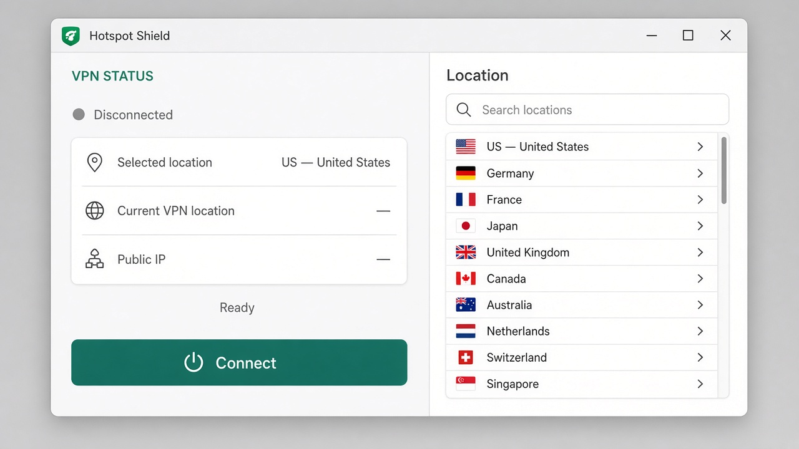
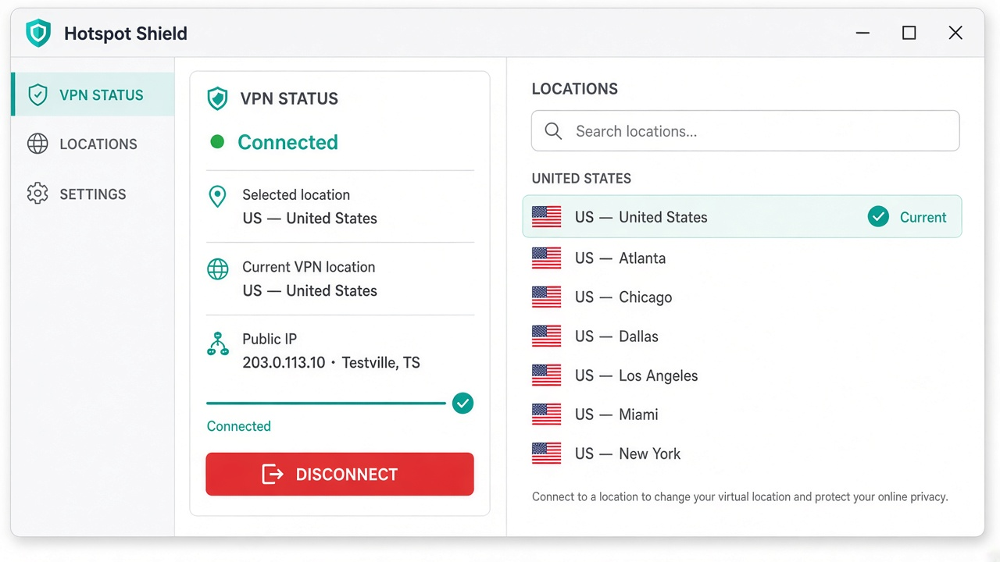
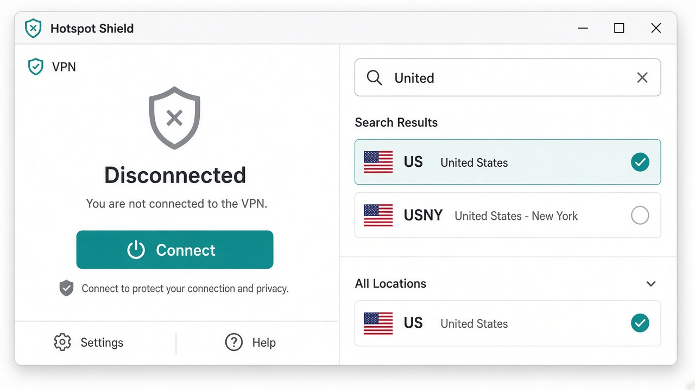
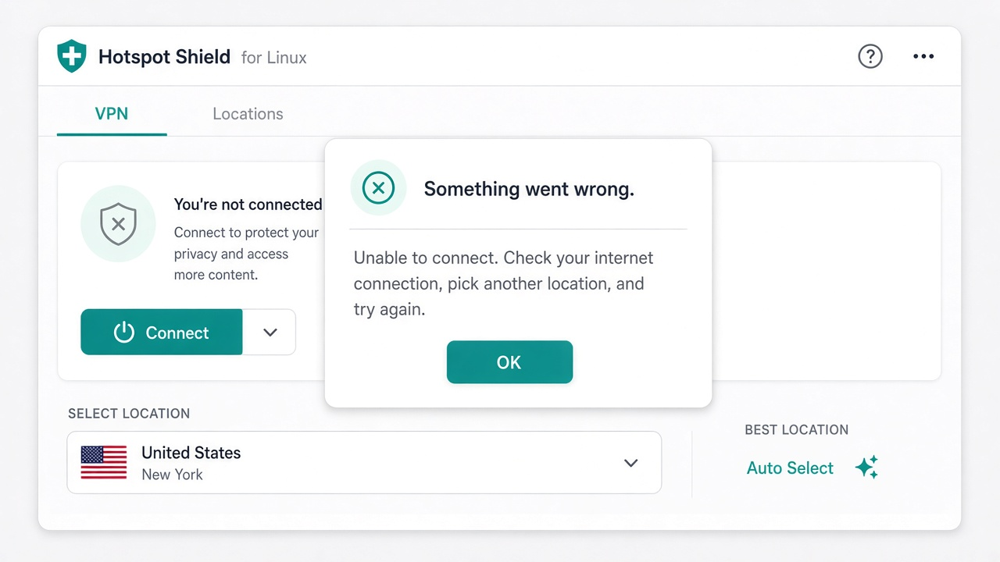

# Hotspot Shield GUI for Linux

A simple, friendly desktop app for Hotspot Shield on Linux.

There is no official Hotspot Shield GUI for Linux. This app gives you one: clear status, searchable locations, one-click
connect/disconnect, and safe server switching — without using the terminal.



---

## Features

- See VPN status, selected location, and public IP at a glance
- Search locations instantly (keyboard-friendly)
- Connect / Disconnect with one primary button
- Change servers while connected (automatic disconnect → reconnect)
- Friendly error messages (no Python tracebacks)
- Sign in through the app — no editing config files
- Quick installer for everyday users

---

## Install (normal users)

You need:

1. A Linux computer (Ubuntu or Debian recommended)
2. The official **Hotspot Shield** Linux CLI (Premium account)
3. This app

### Step 1 — Install Hotspot Shield CLI

Download the Linux package from your [Hotspot Shield account](https://www.hotspotshield.com/vpn/vpn-for-linux) and
install it (example for Ubuntu/Debian):

```bash
sudo apt install ./hotspotshield_*.deb
```

Confirm it works:

```bash
hotspotshield help
```

### Step 2 — Install this app

```bash
git clone https://github.com/ErfanDavoodiNasr/Hotspot-Shield-VPN-GUI-for-Linux.git
cd Hotspot-Shield-VPN-GUI-for-Linux
./install.sh
```

### Step 3 — Open the app

Open **Hotspot Shield GUI** from your application menu,

or run:

```bash
hotspotshield-gui
```

> Tip: make sure `~/.local/bin` is on your PATH. The installer will warn you if it is not.

---

## How to connect

1. Open the app
2. Click **Account…** and enter your Hotspot Shield Premium email and password
3. Search or pick a location on the right
4. Click **Connect**
5. Wait until the status says **Connected**



---

## How to change location

1. While **Connected**, search for another location
2. Double-click it (or press **Enter**)
3. The app disconnects, reconnects, and shows the new location



---

## How to disconnect

Click **Disconnect**.

Closing the window **leaves the VPN connected**. That way you can close the UI without dropping your connection.

---

## Upgrade

```bash
cd Hotspot-Shield-VPN-GUI-for-Linux
git pull
./install.sh --upgrade
```

---

## Uninstall

```bash
./uninstall.sh
```

Add `--purge-config` to also remove saved preferences. This never removes the official Hotspot Shield CLI.

---

## Troubleshooting

| Problem                           | What to do                                                                          |
|-----------------------------------|-------------------------------------------------------------------------------------|
| “Hotspot Shield is not installed” | Install the official CLI package, then reopen the app                               |
| Sign-in failed                    | Use Premium credentials; open **Account…** and try again                            |
| No locations                      | Sign in first, check internet, click **Retry**                                      |
| Stuck waiting                     | Click **Cancel** if shown, or **Refresh status**                                    |
| Connection failed                 | Try another location; check internet                                                |
| App won’t open                    | Install Tk: `sudo apt install python3-tk`                                           |
| Command not found                 | Add `export PATH="$HOME/.local/bin:$PATH"` to `~/.bashrc`, then open a new terminal |

Friendly errors look like this (never a traceback):



Logs (passwords redacted): `~/.local/state/hotspotshield-gui/app.log`

---

## Architecture (developers)

```text
src/hotspotshield_gui/
  app.py              entry point
  ui/                 Tkinter UI
  controllers/        state machine + background work
  services/           VPN + IP
  cli/                process runner, parser, CLI client
  models/             VpnState, Location
  security/           secrets + redaction
  config/             preferences
```

---

## Development setup

```bash
python3 -m venv .venv
source .venv/bin/activate
make install-dev
make test
make lint
make typecheck
```

Useful targets: `make test-unit`, `make test-integration`, `make test-gui`, `make test-security`, `make test-docker`,
`make test-live`, `make coverage`.

Hermetic tests use `scripts/fake_hotspotshield.py` and never touch a real VPN.

Live tests need a **real Linux desktop/VM** where `hotspotshield start` works (not Docker Desktop):

```bash
# credentials only via .secrets/ or env — never commit them
make test-live
```

Capture docs screenshots (Linux + Xvfb + Pillow):

```bash
python scripts/capture_screenshots.py
```

---

## Security notes

- Never put passwords in source files
- Prefer the desktop keyring (Account dialog)
- Optional local secrets for live tests only: `.secrets/hotspotshield_username` and `.secrets/hotspotshield_password` (
  gitignored)
- Set `HOTSPOTSHIELD_USE_SECRETS_FILE=1` if you intentionally want `.secrets/` to override the keyring

---

## License

MIT — see [LICENSE](LICENSE).

Hotspot Shield® is a trademark of its respective owner. This project is an unofficial community GUI and is not
affiliated with Pango / Hotspot Shield.
