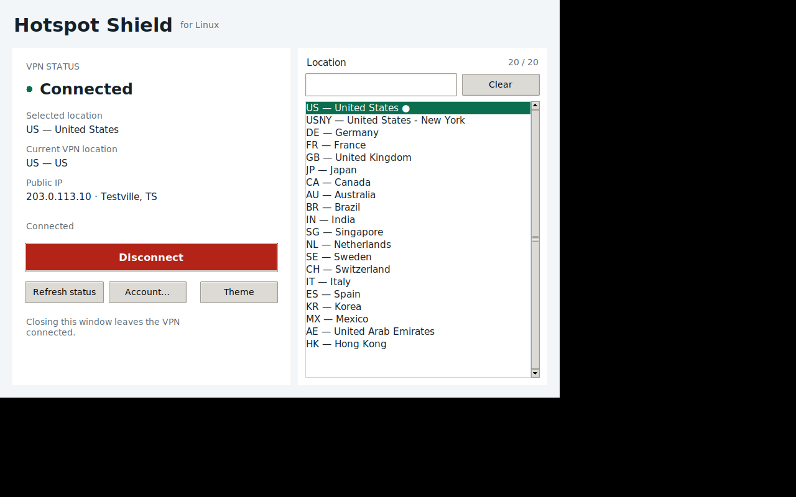

# Hotspot Shield GUI for Linux

Unofficial community desktop GUI for the legacy Hotspot Shield Linux CLI.

**Not affiliated with Hotspot Shield / Aura.** Hotspot Shield discontinued official Linux support on **2025-09-29**.




## Install

### From a repository checkout (works today)

```bash
git clone https://github.com/ErfanDavoodiNasr/Hotspot-Shield-VPN-GUI-for-Linux.git
cd Hotspot-Shield-VPN-GUI-for-Linux
./install.sh
```

Then open **Hotspot Shield GUI** from your applications menu.

You still need the vendor **Hotspot Shield Linux CLI** (stable **1.0.7**, **amd64 only**). See `docs/COMPATIBILITY.md`.

### One-line install (only after a GitHub Release exists)

```bash
# Inspect first (recommended):
curl -fsSLo bootstrap.sh https://raw.githubusercontent.com/ErfanDavoodiNasr/Hotspot-Shield-VPN-GUI-for-Linux/main/scripts/bootstrap.sh
less bootstrap.sh
bash bootstrap.sh

# Or pin a published release (env must be on the bash side of the pipe):
curl -fsSL https://raw.githubusercontent.com/ErfanDavoodiNasr/Hotspot-Shield-VPN-GUI-for-Linux/main/scripts/bootstrap.sh \
  | HOTSPOTSHIELD_GUI_VERSION=1.0.0 bash
```

Bootstrap installs a **tagged GitHub Release**, verifies **SHA256**, and refuses unsigned installs by default. It does *
*not** install from a moving `main` branch.

Until a Release is published, use the git checkout method above.

### Vendor CLI (stable channel)

```bash
./scripts/fetch_vendor_cli.sh stable
sudo apt install ./vendor/hotspotshield_1.0.7_amd64.deb
```

Experimental `1.1.2` is **not** the default (`./scripts/fetch_vendor_cli.sh experimental`).

## Features

- Clear status, searchable locations, connect / disconnect / switch
- Independent egress IP verification before showing Connected
- Live theme switching (system / light / dark) without restart
- Keyring-first credentials (session-only if keyring unavailable)
- Cancel that actually interrupts CLI subprocesses

## Uninstall

```bash
hotspotshield-gui-uninstall
```

(No git checkout required after install.)

## Compatibility & security

- Matrix: [`docs/COMPATIBILITY.md`](docs/COMPATIBILITY.md)
- Architecture: [`docs/ARCHITECTURE.md`](docs/ARCHITECTURE.md)
- Testing: [`docs/TESTING.md`](docs/TESTING.md)
- Security policy: [`SECURITY.md`](SECURITY.md)

## Developers

```bash
python3 -m pip install -e ".[dev]"
make lint typecheck test test-security
```

Screenshots (Xvfb + real UI classes):

```bash
python3 scripts/capture_screenshots.py
```

## License

MIT — see `LICENSE`.
