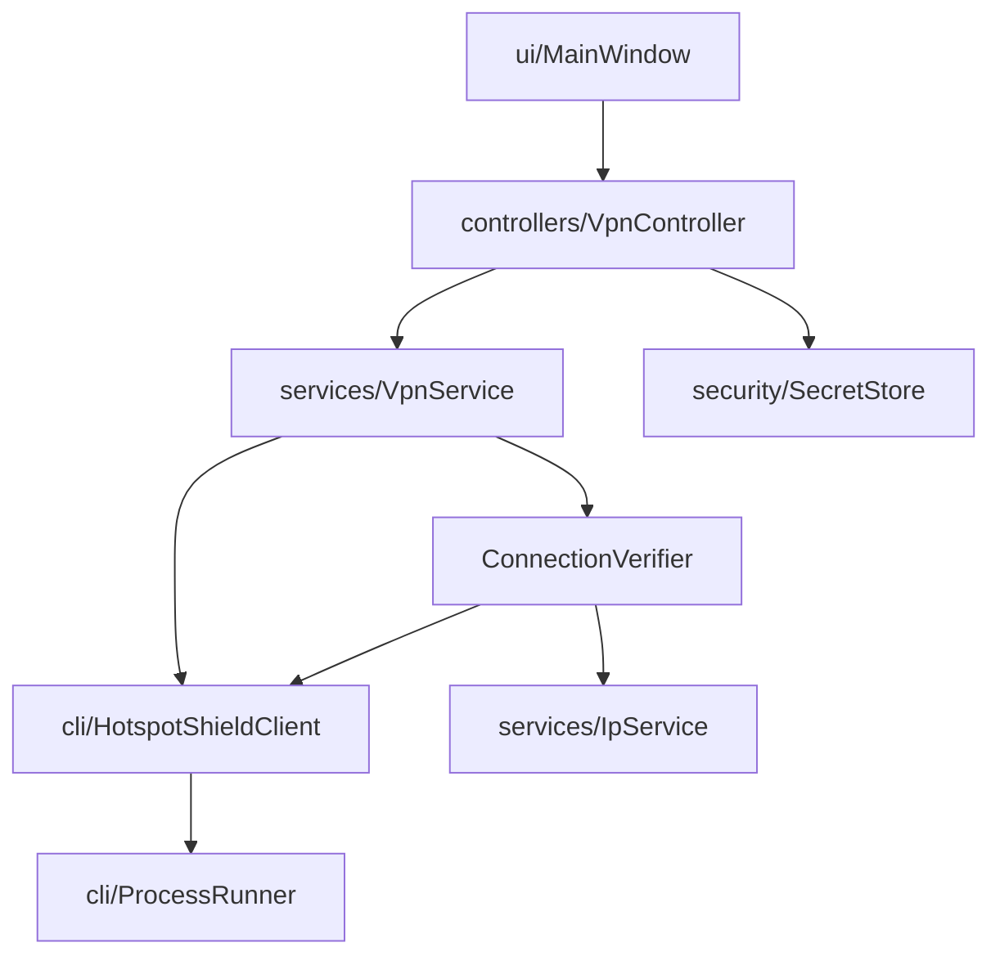

# Architecture

Unofficial Hotspot Shield GUI for Linux.

## Layers

```text
ui/  (Tk)  →  controllers/  →  services/  →  cli/ + security/ + config/
                      ↓
                   models/  (pure state + location types)
```

Dependency direction is downward only:

| Layer | Owns | Must not |
| --- | --- | --- |
| `ui/` | Widgets, themes, user gestures | subprocess, CLI parsing, credential files, IP providers |
| `controllers/` | App state machine orchestration, workers, cancel | Tk widgets |
| `services/` | Connect/disconnect/switch + `ConnectionVerifier` | Tk |
| `cli/` | ProcessRunner + Hotspot Shield client + parsers | Tk, credentials persistence |
| `security/` | Keyring / session credentials, redaction | VPN policy |
| `models/` | `VpnState`, transitions, `Location` | infrastructure |

## Single sources of truth

- **VPN UI state:** `VpnController.machine` (`StateMachine`)
- **Authoritative protection claim:** `ConnectionVerifier` (CLI status + IP consensus)
- **Subprocess execution:** `ProcessRunner` only
- **Credentials:** `SecretStore` only

## Threading

Tk main thread renders and polls `VpnController.events`.
Workers run CLI/network work; they never touch widgets directly.
Cancel sets an `Event` that `ProcessRunner` observes (process-group terminate).

## Installer

- `scripts/bootstrap.sh` — download + verify release, then call `install.sh`
- `install.sh` — canonical per-user install (venv, launcher, uninstall wrapper)
- `uninstall.sh` / `hotspotshield-gui-uninstall` — remove app files only (not vendor CLI)


